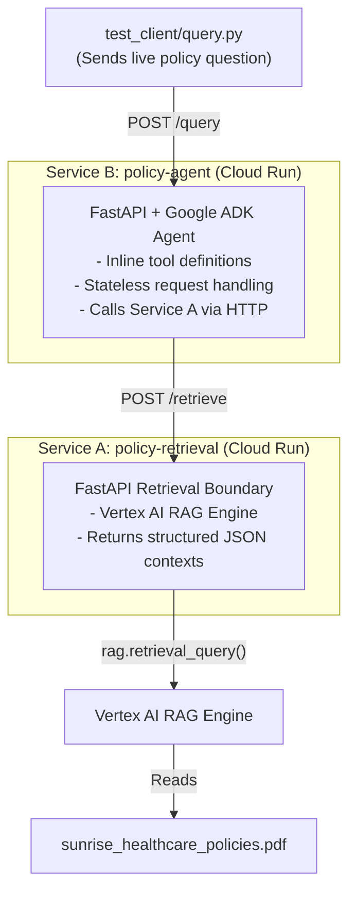
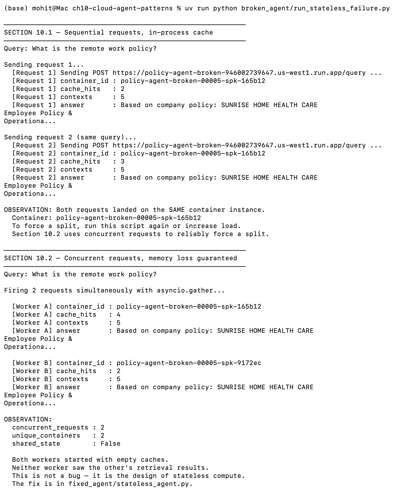

# Chapter 10: From Local Triumph to Cloud Failure

**Part 4 of *From Local Triumph to Cloud Failure***

Companion code for Chapter 10. Shows why an agent that appears correct on a laptop can fail in a stateless cloud deployment, and how to fix that failure by moving retrieval out of process and into a dedicated FastAPI service backed by Vertex AI RAG Engine.

> **New to this repo?** Start with [setup-guide.md](setup-guide.md) for the full deployment walkthrough.

---

## Architecture



Service A is the **persistence boundary**. Service B stays stateless; all retrieval state lives in the external RAG-backed service.

---

## What the repo teaches

| Section | Goal | Key observable |
|---|---|---|
| 10.1 | In-process memory fails across stateless cloud requests | Sequential requests show `cache_hits: 0` on each container |
| 10.2 | Concurrent workers do not share memory | `unique_containers: 2`, `shared_state: False` |
| 10.3 | Architectural fix via external retrieval | Fixed agent returns `cache_hits: N/A` — correct by design |
| 10.4 | Dedicated FastAPI retrieval boundary | `/retrieve` returns structured JSON from Vertex AI RAG |
| 10.5 | Resilient cloud backend | `/health`, `/ready`, structured logs, end-to-end validation pass |

---

## Repository structure

```
ch10-cloud-agent-patterns/
├── broken_agent/            # Stateful implementation (demonstrates failure)
│   ├── stateful_agent.py    # Module-level _retrieval_cache anti-pattern
│   ├── app.py               # FastAPI wrapper (policy-agent-broken service)
│   ├── Dockerfile           # Builds from repo root
│   └── run_stateless_failure.py  # Demo script for Sections 10.1 and 10.2
├── fixed_agent/             # Stateless implementation (the fix)
├── retrieval_service/       # Service A: FastAPI RAG wrapper
├── agent_service/           # Service B: FastAPI agent wrapper
├── scripts/                 # Deployment helpers
├── cloudbuild.yaml          # Builds policy-agent image
├── cloudbuild_broken.yaml   # Builds policy-agent-broken image
├── validate_env.py          # Local environment check
├── validate_gcp.py          # GCP credentials and API check
├── validate_rag.py          # RAG corpus check
└── validate_services.py     # End-to-end service health check
```

---

## Quick start (services already deployed)

If the three Cloud Run services are already running, copy `.env.example` to `.env`, fill in the URLs, then run each demo directly:

```bash
git clone https://github.com/mohitagr18/ch10-cloud-agent-patterns.git
cd ch10-cloud-agent-patterns
uv sync
cp .env.example .env
# Edit .env with your RETRIEVAL_SERVICE_URL, AGENT_SERVICE_URL, BROKEN_AGENT_URL
```

### Test 1 — Statelessness failure (Sections 10.1 and 10.2)

```bash
uv run python broken_agent/run_stateless_failure.py
```

Expected in Section 10.2:
```
[Worker A] container_id : policy-agent-broken-00005-xxx-aaaaaa
[Worker B] container_id : policy-agent-broken-00005-xxx-bbbbbb  <- different instance
unique_containers : 2
shared_state      : False
```


### Test 2 — Fixed agent (Section 10.3)

```bash
curl -X POST $AGENT_SERVICE_URL/query \
  -H 'Content-Type: application/json' \
  -d '{"query": "What is the remote work policy?"}'
```

Expected: `cache_hits` is `"N/A — stateless agent; no in-process cache exists"`.

### Test 3 — Retrieval service direct (Section 10.4)

```bash
curl -X POST $RETRIEVAL_SERVICE_URL/retrieve \
  -H 'Content-Type: application/json' \
  -d '{"query": "What is the vacation policy?"}'
```

Expected: `contexts` array with 5 entries.

### Test 4 — Full end-to-end validation

```bash
uv run python validate_services.py
```

All three checks should print `PASS`.

---

## Prerequisites

- Python 3.11+, `uv`, `Docker`, `gcloud` CLI
- GCP project with Vertex AI, Artifact Registry, and Cloud Run APIs enabled
- Service account with `roles/aiplatform.user` and `roles/aiplatform.admin`

For first-time setup or redeployment, see **[setup-guide.md](setup-guide.md)**.

---

## Deployed service URLs (chapter GCP project)

| Service | URL |
|---|---|
| Service A: policy-retrieval | `https://policy-retrieval-946002739647.us-west1.run.app` |
| Service B (fixed): policy-agent | `https://policy-agent-klw32utc7a-uw.a.run.app` |
| Service B (broken): policy-agent-broken | `https://policy-agent-broken-946002739647.us-west1.run.app` |

---

## Workflow & Manuscript Diagrams

The `workflow/` directory contains chapter-friendly Mermaid diagrams explaining the core architecture and failure patterns. You can copy the Mermaid block directly into your book/manuscript:

- [01-local-failure.md](workflow/01-local-failure.md) → **Section 10.1**: Local success vs cloud failure
- [02-concurrent-workers.md](workflow/02-concurrent-workers.md) → **Section 10.2**: Concurrent workers isolation
- [03-stateless-fix.md](workflow/03-stateless-fix.md) → **Section 10.3**: The stateless fix concept
- [04-retrieval-service.md](workflow/04-retrieval-service.md) → **Section 10.4**: The FastAPI retrieval boundary
- [05-end-to-end-cloud-run.md](workflow/05-end-to-end-cloud-run.md) → **Section 10.5**: End-to-end cloud infrastructure
- [06-env-wiring.md](workflow/06-env-wiring.md) → Wiring and environment config
- [07-broken-vs-fixed.md](workflow/07-broken-vs-fixed.md) → Side-by-side architectural comparison
- [all-diagrams.md](workflow/all-diagrams.md) → One-file appendix containing all diagrams in sequence

---

## Troubleshooting

| Symptom | Fix |
|---|---|
| `unique_containers: 1` every run | Redeploy `policy-agent-broken` with `--concurrency 1 --min-instances 2` |
| `cache_hits: "N/A"` on broken agent | Set `BROKEN_AGENT_URL` in `.env` — script prefers it over `AGENT_SERVICE_URL` |
| `502` errors | Check `RETRIEVAL_SERVICE_URL` is in `--set-env-vars` on the broken agent deploy |
| `validate_services.py` fails | Run `curl <url>/health` on each service; check Cloud Run logs |
| Build fails | Run `gcloud builds submit` from **repo root**, not from a subdirectory |

## Dependency management

This project uses **uv** for all dependency management. Never use `pip install` directly.
