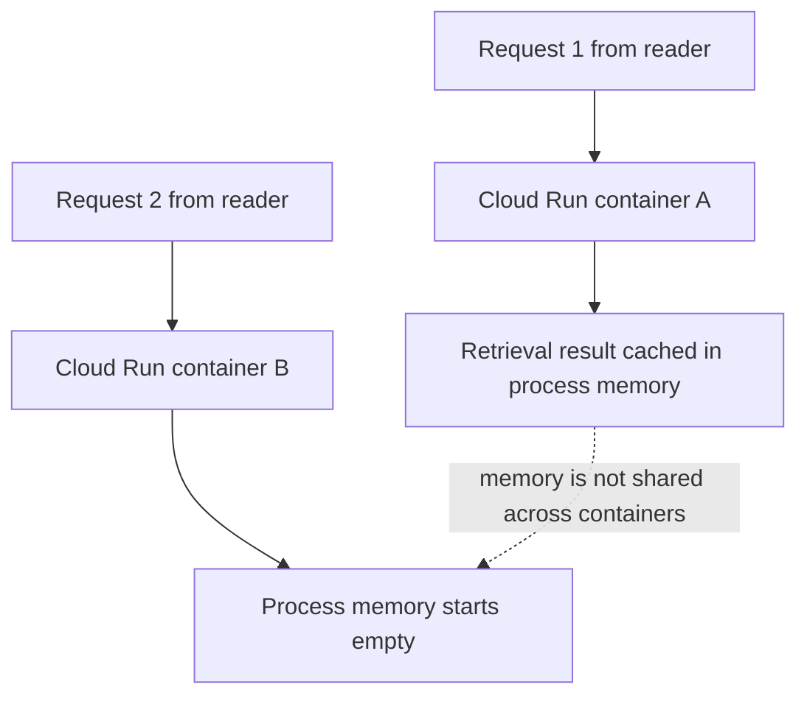

# 01. Local success, cloud failure

## Caption

A stateful agent can look correct in local development because repeated calls
hit the same Python process. In Cloud Run, the next request may land on a
separate container, so the earlier in-process cache is no longer available.

## Mermaid

## What the reader should notice

- Local success can hide a cloud deployment flaw.
- Each Cloud Run container owns its own process memory.
- The second request does not inherit the first request's cached state.
- The failure comes from the deployment model, not from Python itself.
