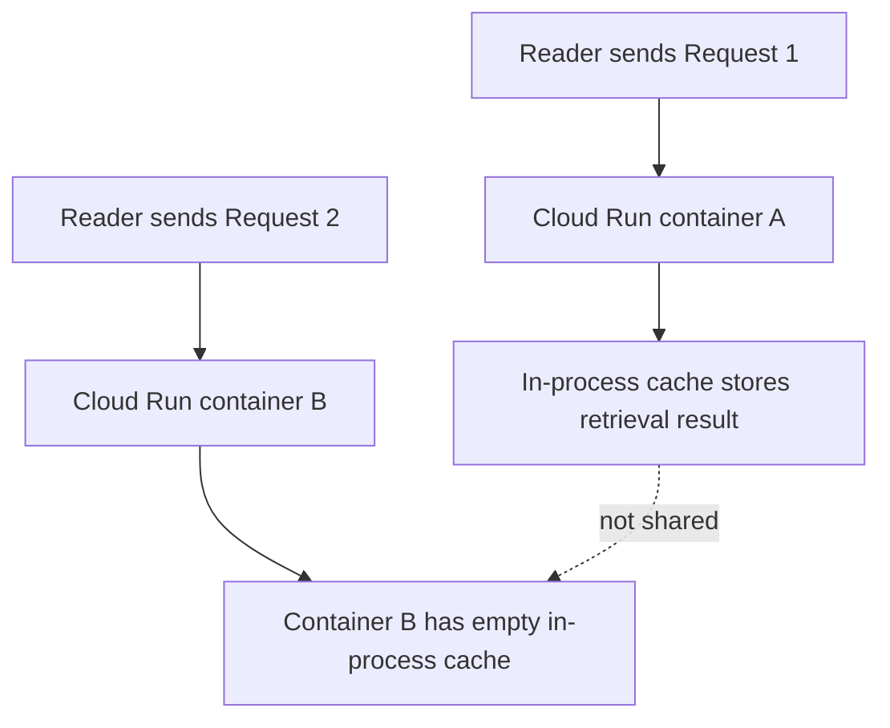

# 01. Local success, cloud failure

## Caption

A stateful agent can appear correct on a laptop because both requests hit the
same Python process. In Cloud Run, the second request may land on a different
container, so the in-process cache disappears.

## Mermaid

## What the reader should notice

- The local mental model assumes one long-lived process.
- Cloud Run routes requests to whichever container is available.
- Memory inside container A is invisible to container B.
- The failure is architectural, not a Python bug.
