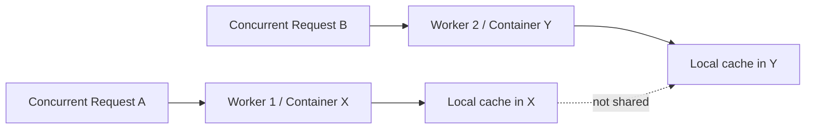

# 02. Concurrent workers do not share memory

## Caption

Concurrent requests make the statelessness problem easier to see. Two workers
can handle the same query at the same time, and both start with empty
in-process state.

## Mermaid

## What the reader should notice

- Each worker owns its own process memory.
- Cached retrievals, session history, and loaded state stay local to that worker.
- Concurrency does not merge memory. It multiplies isolated memory islands.
- This is why stateful agent backends become unreliable in serverless systems.
