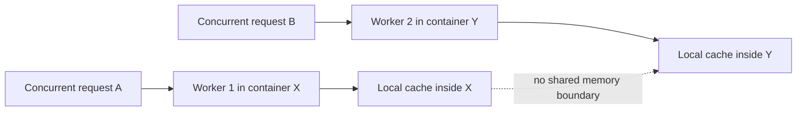

# 02. Concurrent workers do not share memory

## Caption

Concurrent traffic makes the state problem easier to see. Two requests can be
handled at the same time by separate workers, and each worker begins with its
own isolated in-process state.

## Mermaid

## What the reader should notice

- Concurrency increases the number of isolated worker memories.
- Cached retrievals and session state stay trapped inside one worker.
- A multi-worker backend is not a shared-memory system.
- This is why stateful agent servers become unreliable under real load.
