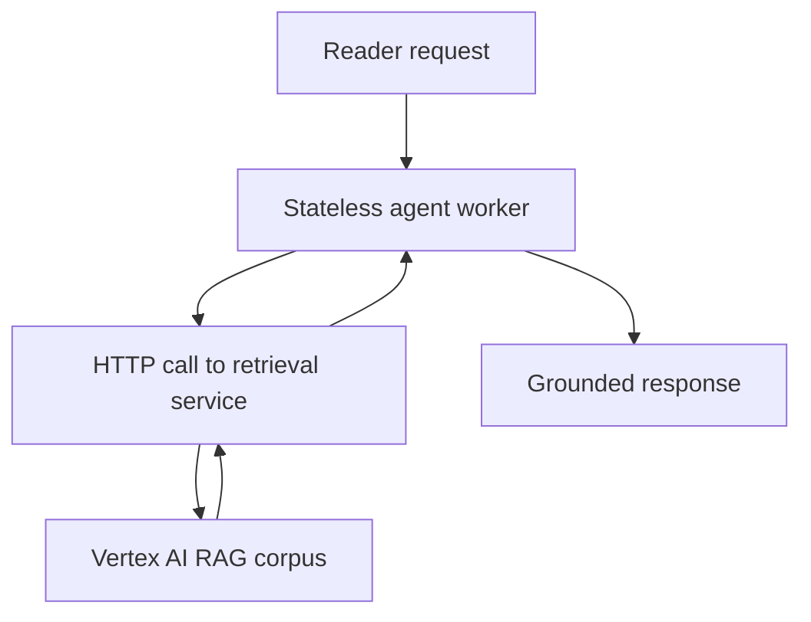

# 03. The stateless fix

## Caption

The fix is not to make the cache smarter. The fix is to remove retrieval state
from the agent process and move it behind a durable external service boundary.

## Mermaid

## What the reader should notice

- The agent worker carries no mutable retrieval state between requests.
- Every request brings its own query and gets fresh retrieval over HTTP.
- Retrieval consistency comes from the external service, not from process memory.
- This pattern works no matter which Cloud Run instance handles the request.
