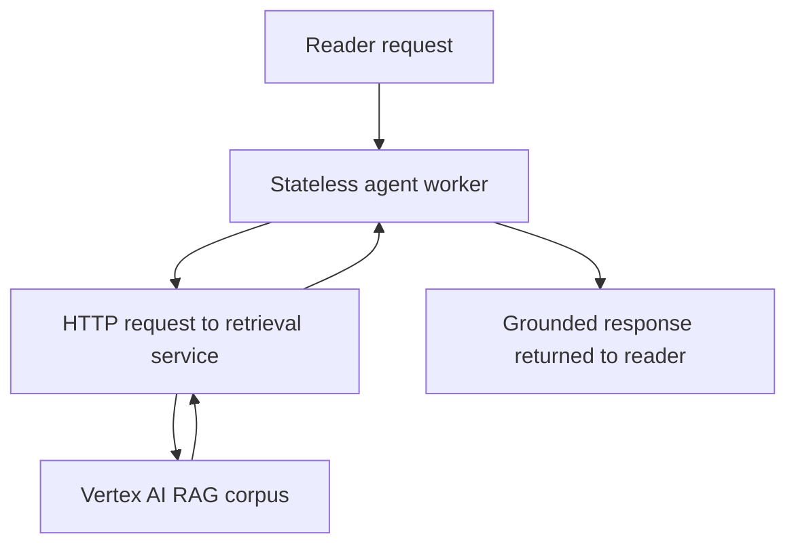

# 03. The stateless fix

## Caption

The solution is architectural. Retrieval state leaves the agent process and
moves behind an external service boundary that every worker can reach in the
same way.

## Mermaid

## What the reader should notice

- The agent worker keeps no mutable retrieval state between requests.
- Every request performs retrieval through the same external path.
- Consistency comes from shared external infrastructure, not from local memory.
- Any Cloud Run instance can now answer the request correctly.
