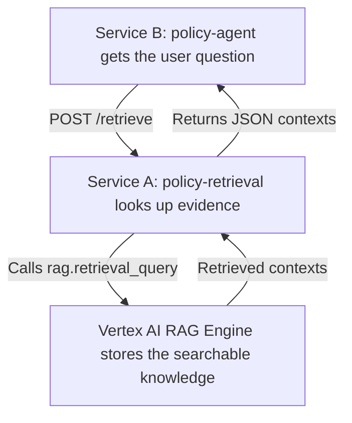

# 04. FastAPI as the retrieval boundary

## Caption

In the fixed design, the agent does not try to remember company knowledge inside
its own process. Instead, it sends each question to a small retrieval service,
which looks up the relevant policy material in Vertex AI RAG Engine and sends
that evidence back. The final answer is grounded in retrieved documents rather
than in container memory.

## Mermaid

## What the reader should notice

- Service A is the place that knows how to find relevant documents.
- Service B is the place that knows how to answer the user.
- The agent no longer depends on remembering earlier retrievals in local memory.
- Every Cloud Run worker can ask the same retrieval service for the same evidence.
