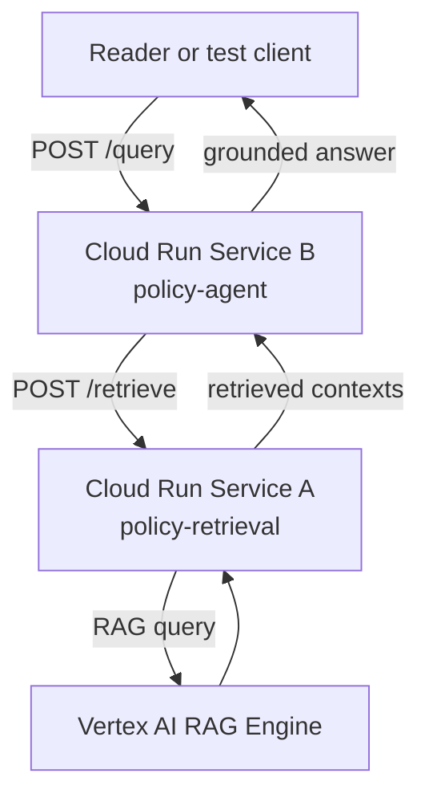

# 05. End-to-end resilient cloud flow

## Caption

The final deployed stack is a two-service Cloud Run architecture. The reader's
query enters Service B, retrieval happens in Service A, and the answer returns
with no dependency on in-process memory.

## Mermaid

## What the reader should notice

- The reader interacts with one public backend, Service B.
- Service B does not retrieve from Vertex AI directly.
- Service A isolates retrieval and can be observed, tested, and scaled separately.
- This is the production pattern the chapter wants the reader to adopt.
