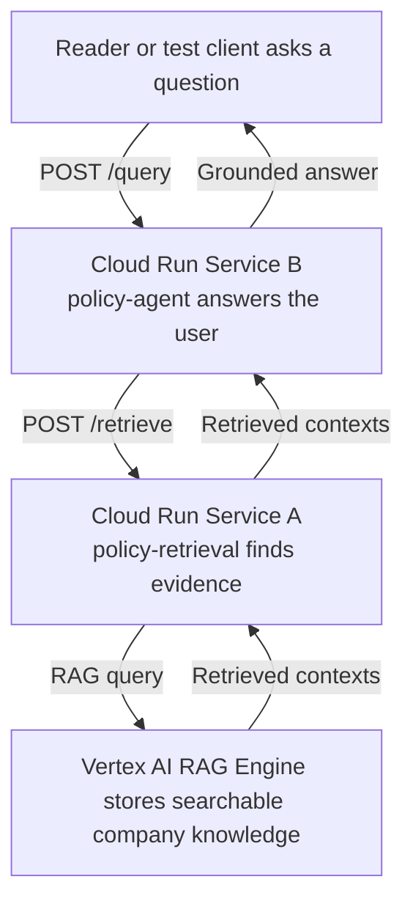

# 05. End-to-end resilient cloud flow

## Caption

This figure shows the full path of a real question in the fixed design. The
user talks to the agent service, the agent service asks the retrieval service
for supporting evidence, and the retrieval service looks that evidence up in
Vertex AI RAG Engine. The answer comes back grounded in retrieved documents,
not in whatever one container happened to remember.

## Mermaid

## What the reader should notice

- The reader speaks to only one public service, Service B.
- Service B does not need to store company knowledge in memory.
- Service A exists to fetch the right evidence for the question.
- The final answer is reliable because every worker can reach the same knowledge source.
