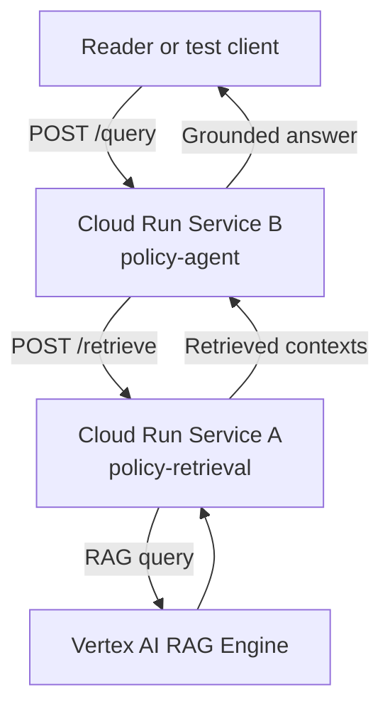

# 05. End-to-end resilient cloud flow

## Caption

The deployed system uses two Cloud Run services. The agent backend receives the
user query, the retrieval service fetches durable context, and the grounded
answer returns without relying on in-process state.

## Mermaid

## What the reader should notice

- Readers interact with one public backend, Service B.
- Service B delegates retrieval rather than owning it.
- Service A provides a stable retrieval API for any worker.
- The architecture supports resilience because no answer depends on local memory surviving.
