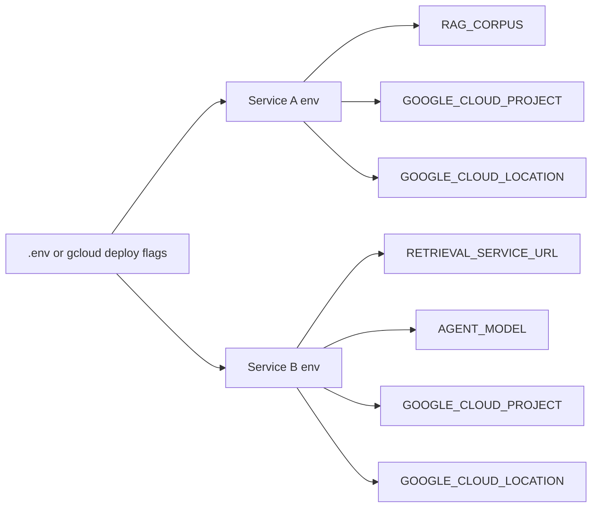

# 06. Environment-variable wiring at deploy time

## Caption

The two services are connected at deployment time through environment variables.
No project IDs, URLs, corpus names, or model names are hardcoded in the code.

## Mermaid

## What the reader should notice

- Service B discovers Service A through `RETRIEVAL_SERVICE_URL`.
- Service A discovers the corpus through `RAG_CORPUS`.
- The deploy command is part of the architecture, not an afterthought.
- This wiring keeps the repository portable across projects and environments.
