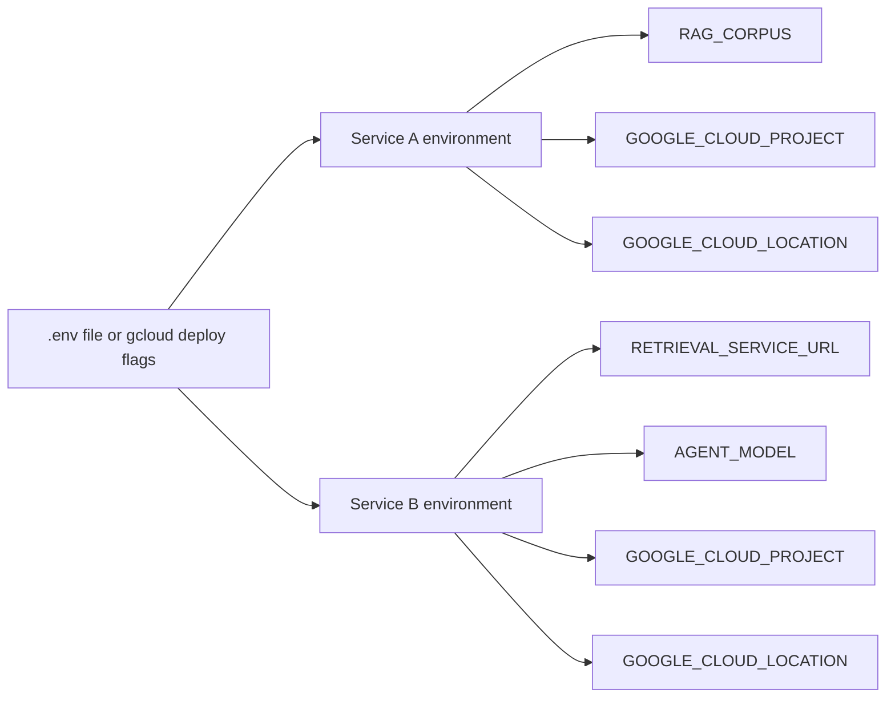

# 06. Environment-variable wiring at deploy time

## Caption

The two services are connected by deployment-time configuration. Resource
names, service URLs, and model choices come from environment variables rather
than from hardcoded values in the repository.

## Mermaid

## What the reader should notice

- Service B discovers Service A through `RETRIEVAL_SERVICE_URL`.
- Service A discovers the RAG corpus through `RAG_CORPUS`.
- Deployment configuration is part of the architecture.
- This keeps the code portable across projects, regions, and environments.
