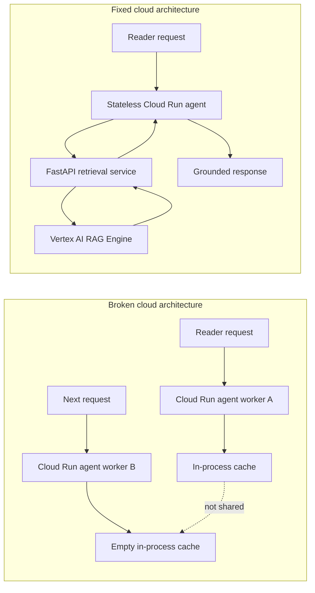

# 07. Broken architecture vs fixed architecture

## Caption

This side-by-side comparison shows the chapter's main lesson in one figure. The
broken version keeps retrieval state inside the agent worker. The fixed version
moves retrieval behind an external FastAPI service backed by Vertex AI RAG
Engine.

## Mermaid

## What the reader should notice

- In the broken design, memory is trapped inside whichever worker handled the last request.
- In the fixed design, retrieval leaves the worker and moves to a shared external service.
- The fixed version is reliable because every worker can reach the same retrieval boundary.
- The architecture changes, not just the code style.
