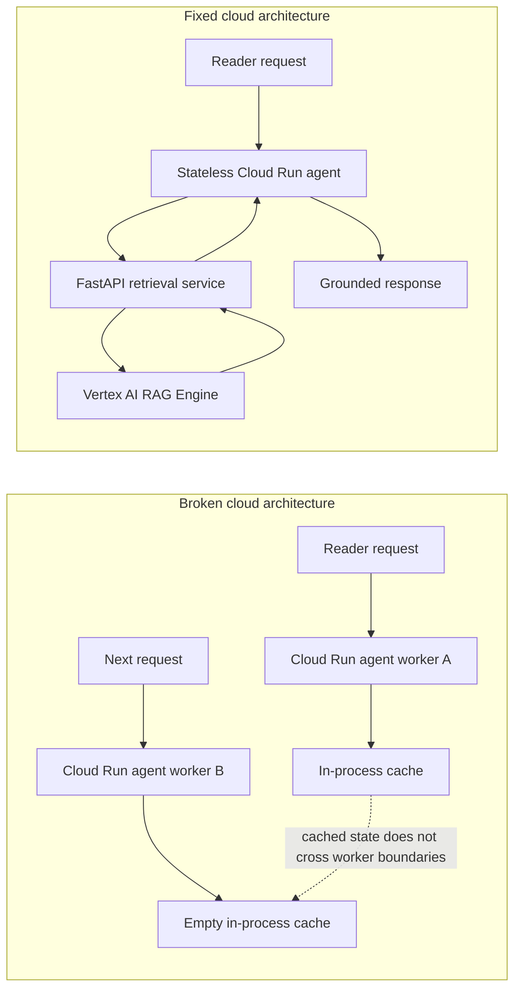

# 07. Broken architecture vs fixed architecture

## Caption

This comparison figure captures the chapter's central lesson. The broken design
keeps retrieval state inside the agent worker, while the fixed design places
retrieval behind a shared external FastAPI service backed by Vertex AI RAG
Engine.

## Mermaid

## What the reader should notice

- In the broken design, memory stays trapped inside one worker.
- In the fixed design, retrieval moves to a shared service boundary.
- Every worker can now reach the same retrieval system.
- The key change is architectural, not cosmetic.
