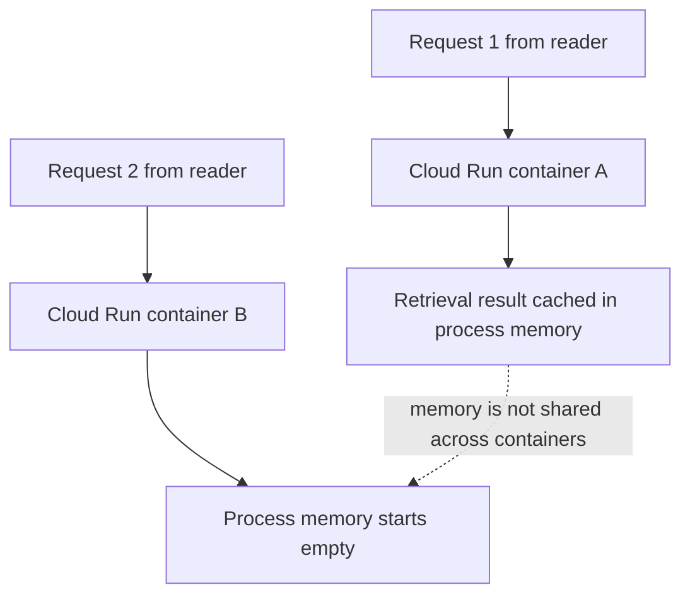
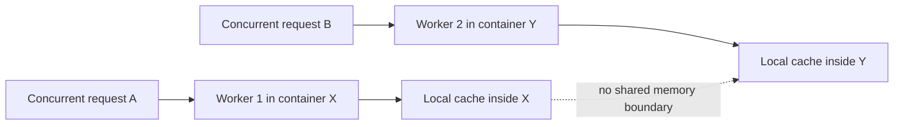
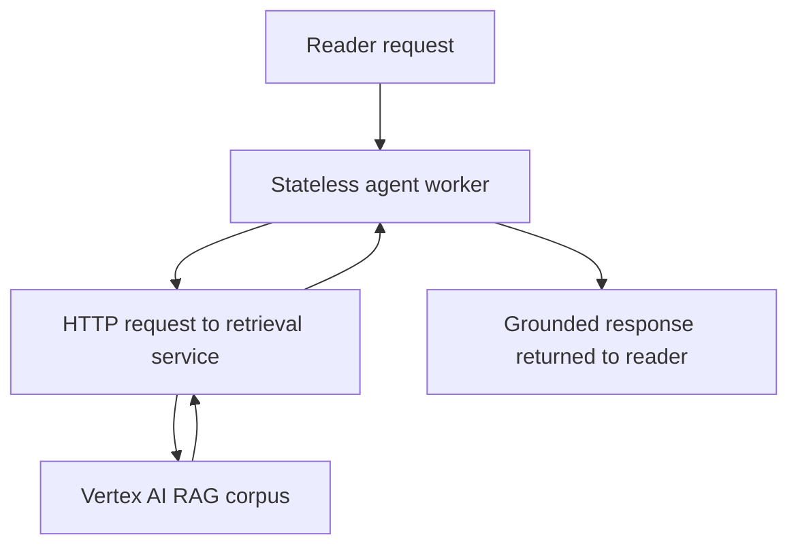
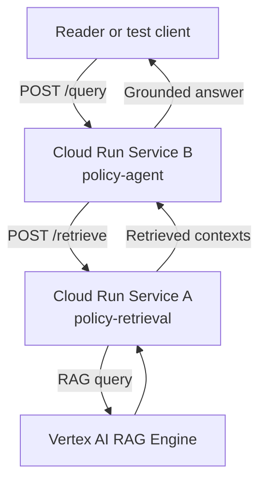
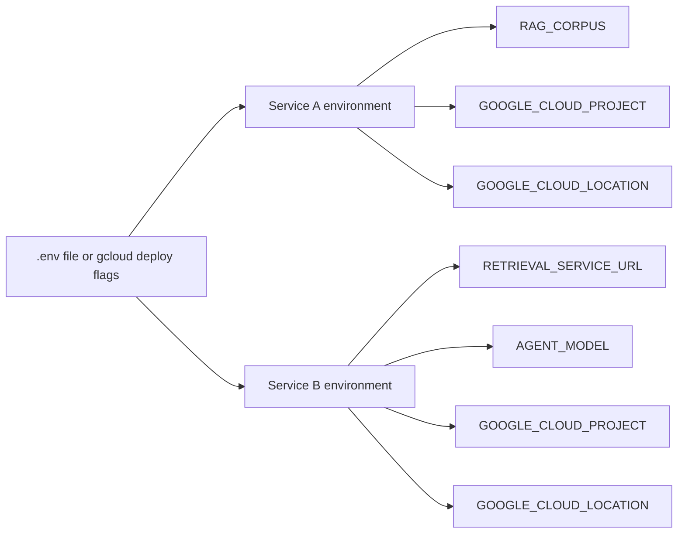
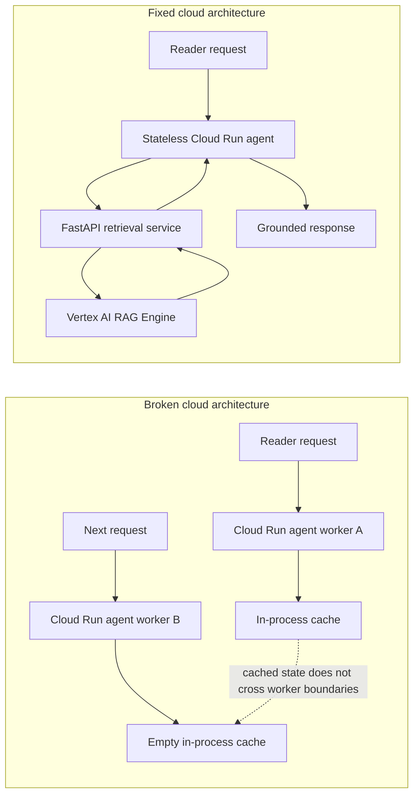

# Chapter 10 workflow diagrams

This appendix-style file gathers every Mermaid diagram for Chapter 10 in one
place, in chapter order. Use it for editorial review, figure planning, or
manuscript handoff.

---

## 10.1 Local success, cloud failure



**Figure intent:** Show that local success can hide the loss of in-process state
once requests begin landing on separate cloud containers.

---

## 10.2 Concurrent workers do not share memory



**Figure intent:** Show that concurrent requests multiply isolated worker
memories rather than creating a shared stateful system.

---

## 10.3 The stateless fix



**Figure intent:** Show that the fix is architectural. Retrieval becomes an
external shared capability instead of a local worker detail.

---

## 10.4 FastAPI as the retrieval boundary

```mermaid
flowchart TD
    A[Service B: policy-agent] -->|POST /retrieve| B[Service A: policy-retrieval]
    B -->|rag.retrieval_query()| C[Vertex AI RAG Engine]
    C --> B
    B -->|JSON contexts| A
```

**Figure intent:** Show the retrieval boundary introduced by the chapter.

---

## 10.5 End-to-end resilient cloud flow



**Figure intent:** Show the complete production path from user request to
retrieved context to grounded answer.

---

## Deployment wiring



**Figure intent:** Show that service discovery and cloud configuration are set
at deployment time rather than embedded in source code.

---

## Broken vs fixed comparison



**Figure intent:** Provide one summary figure for the chapter's central
architectural contrast.
