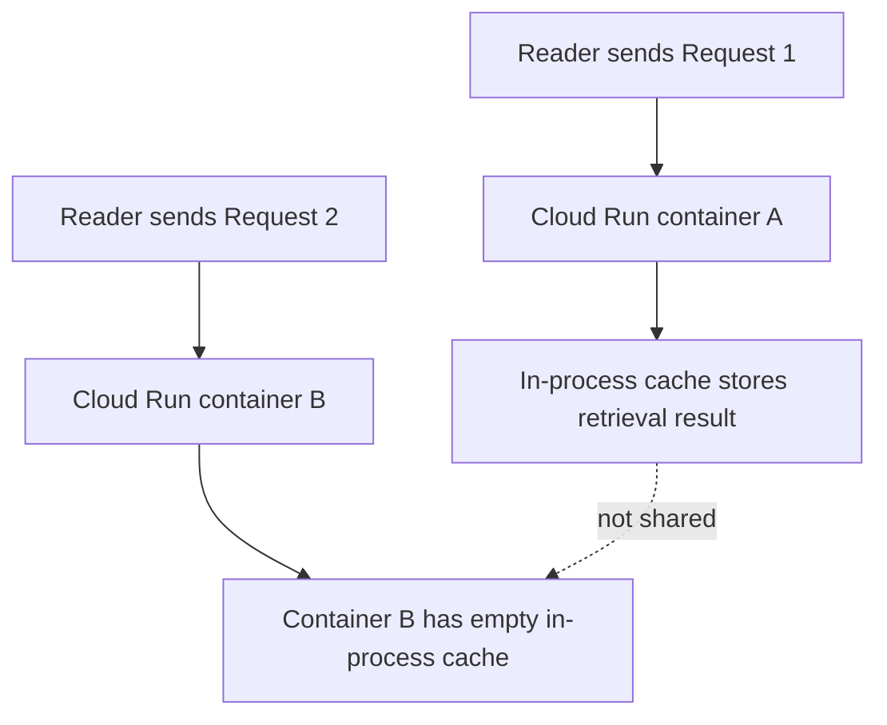
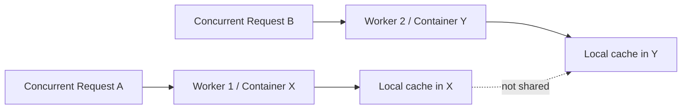
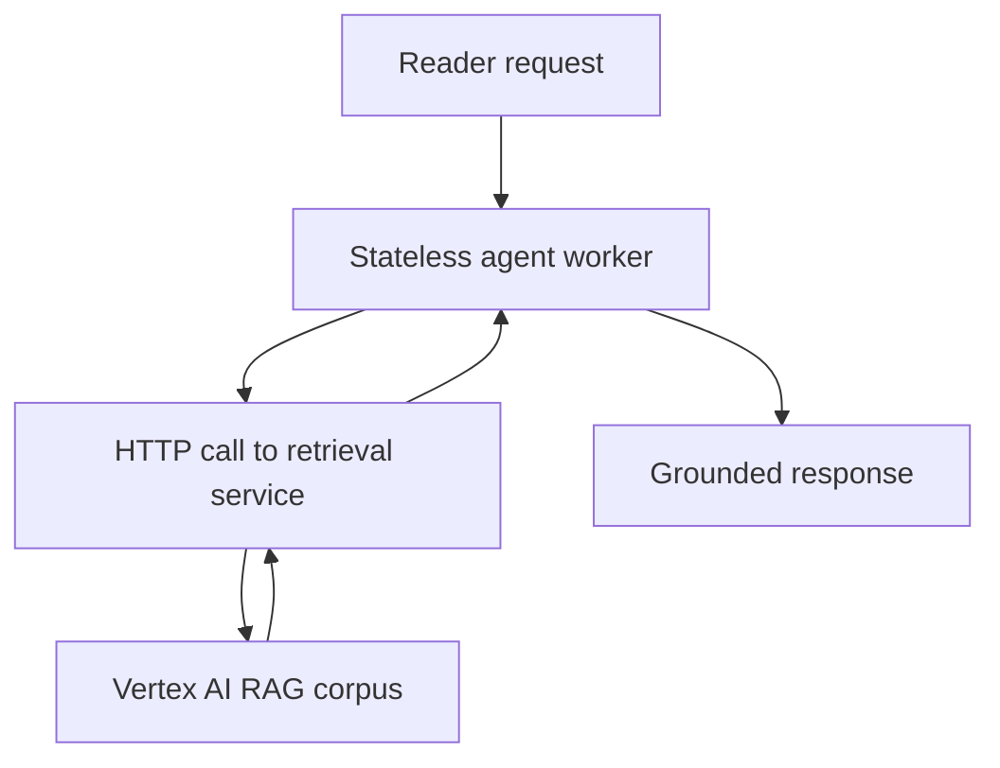
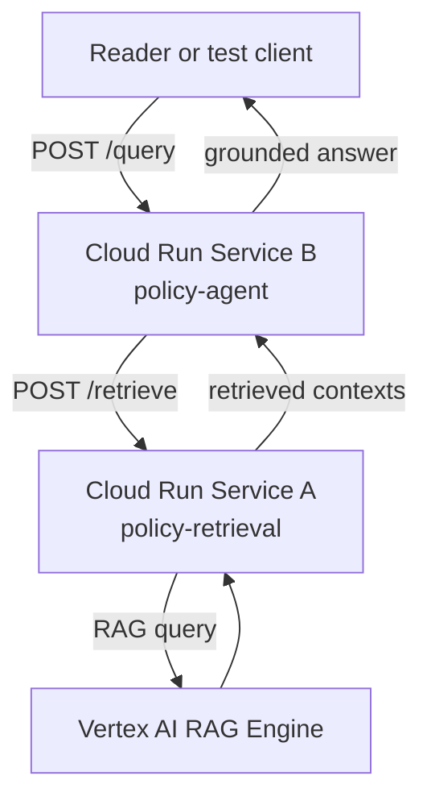
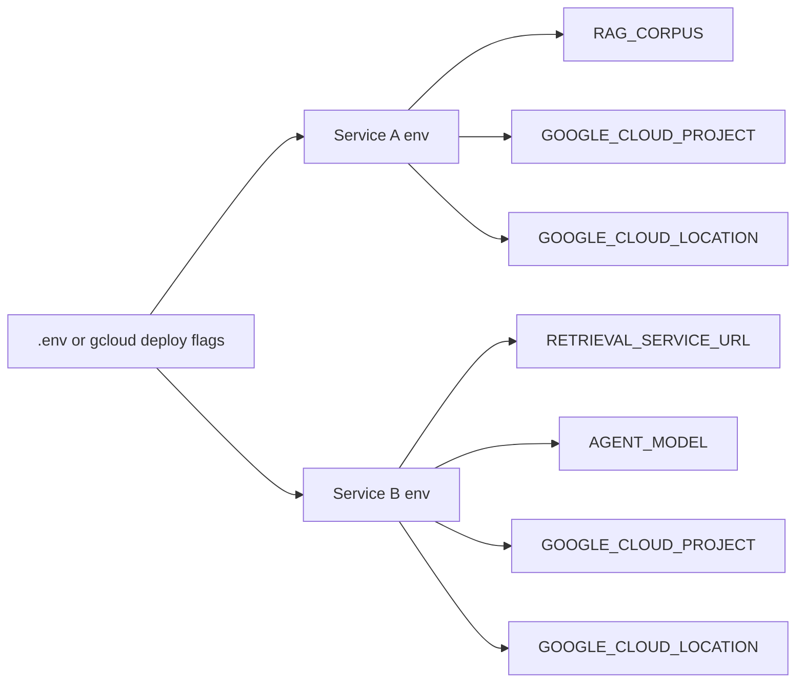
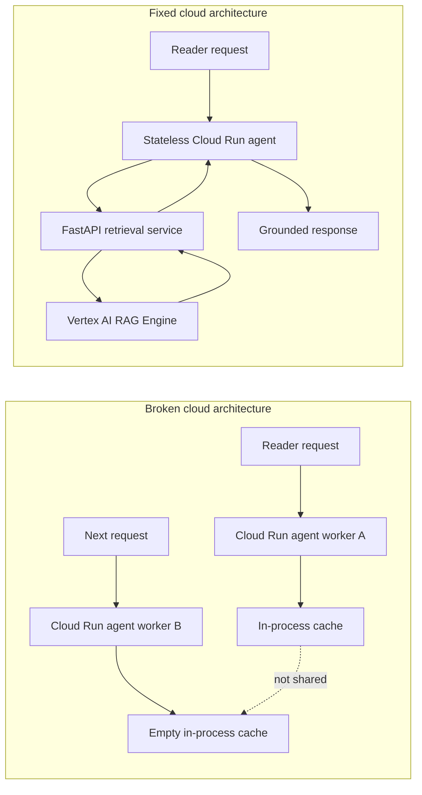

# Chapter 10 workflow diagrams

This appendix-style file collects every Mermaid diagram for Chapter 10 in one
place, in chapter order. Use it as an editorial handoff document, a review aid,
or a quick source for manuscript figures.

---

## 10.1 Local success, cloud failure



**Figure intent:** Show that the second cloud request may land on a different
container, so in-process state disappears.

---

## 10.2 Concurrent workers do not share memory



**Figure intent:** Show that concurrency creates multiple isolated memory
islands, not a shared stateful backend.

---

## 10.3 The stateless fix



**Figure intent:** Show that the fix is architectural. Retrieval moves out of
process and becomes externally shared.

---

## 10.4 FastAPI as the retrieval boundary

```mermaid
flowchart TD
    A[Service B: policy-agent] -->|POST /retrieve| B[Service A: policy-retrieval]
    B -->|rag.retrieval_query()| C[Vertex AI RAG Engine]
    C --> B
    B -->|JSON contexts| A
```

**Figure intent:** Show the new service boundary introduced by the chapter.

---

## 10.5 End-to-end resilient cloud flow



**Figure intent:** Show the full production path from client request to grounded
answer.

---

## Deployment wiring



**Figure intent:** Show that service discovery and cloud configuration happen at
deploy time, not through hardcoded values.

---

## Broken vs fixed comparison



**Figure intent:** Provide one summary visual for the chapter's core argument.
